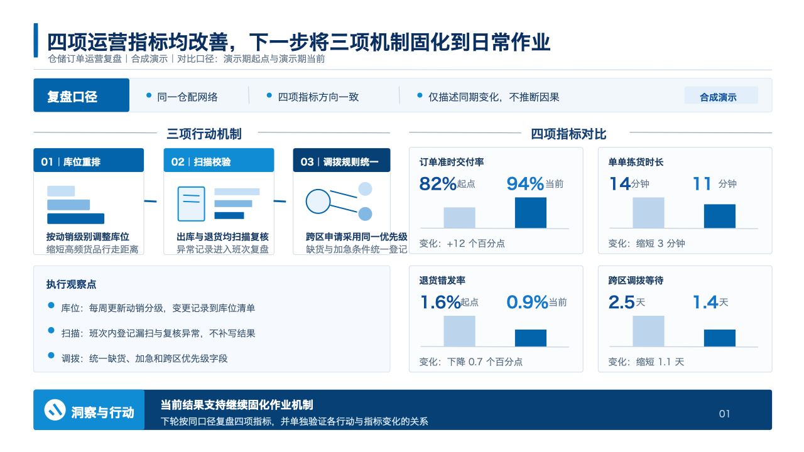
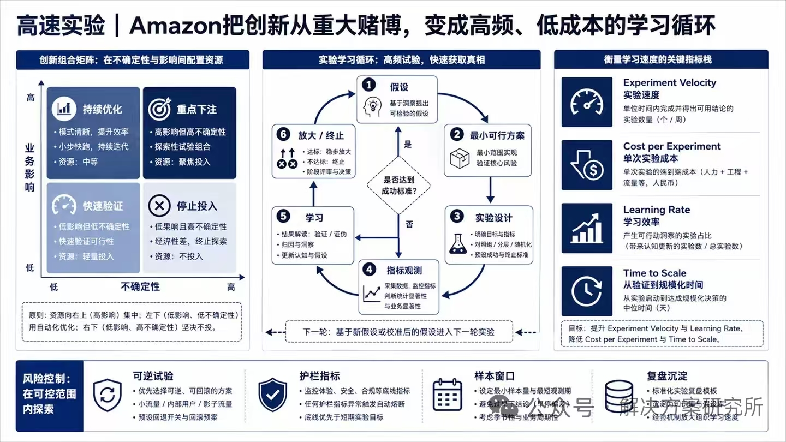
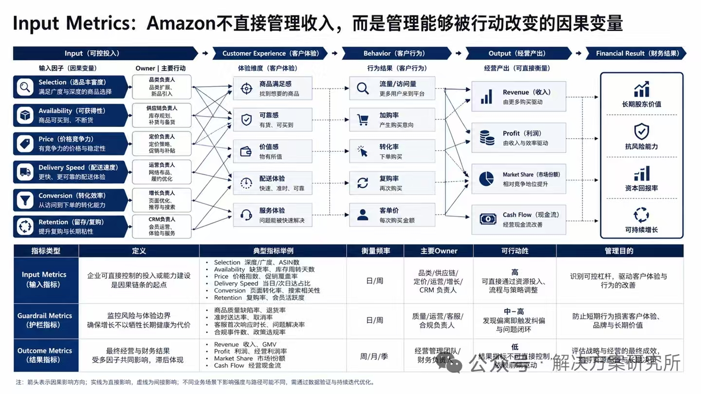
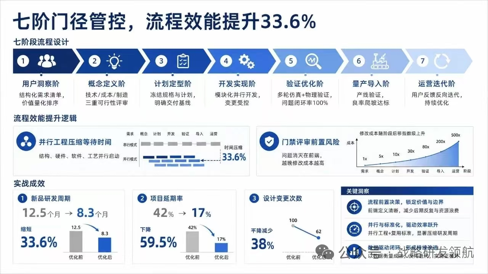
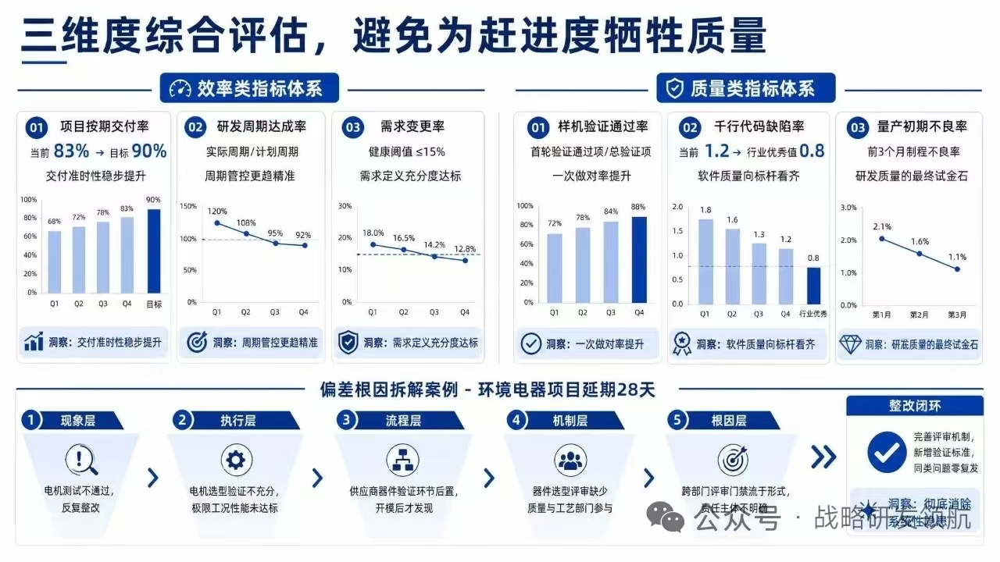
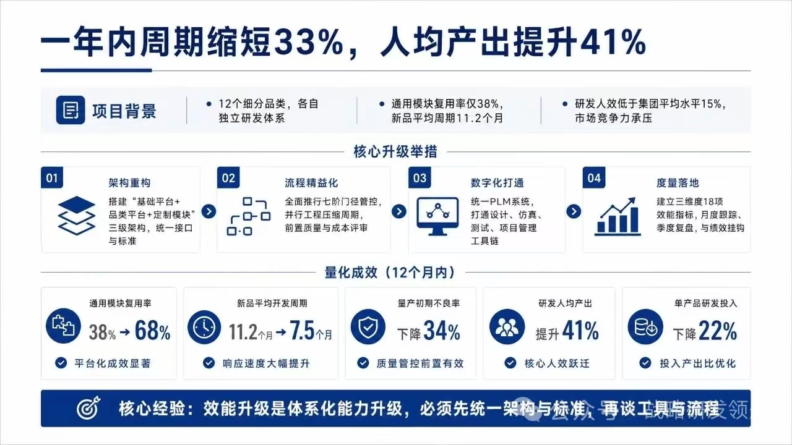
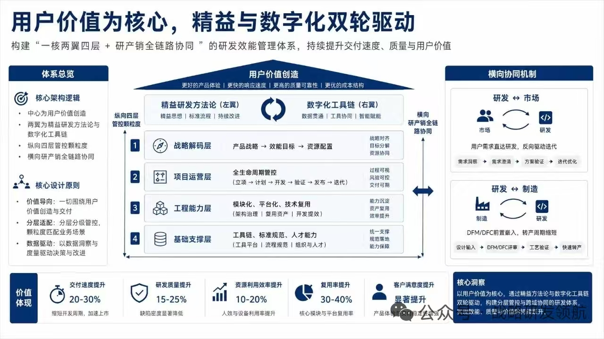
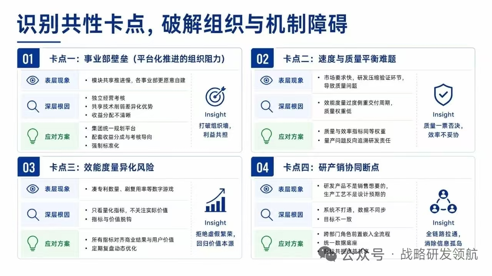

# ppt-workbench

给 Agent 用的中文业务汇报技能。结论先行，一页讲完一个判断，图表、表格和流程都是可编辑对象。

适合客户介绍、经营复盘、项目汇报、方案汇报和年度总结。

## 安装

```bash
npx skills add jyyconrad/ubrio-ppt
```

指定 Claude Code、Codex 或 Grok：

```bash
npx skills add https://github.com/jyyconrad/ubrio-ppt/tree/main/ppt-workbench -g -a claude-code -a codex -a grok -y
```

Claude Code 也可以登记插件市场：

```text
/plugin marketplace add jyyconrad/ubrio-ppt
```

也可以把 `ppt-workbench/` 整个目录复制到宿主的技能目录。目录名必须是 `ppt-workbench`。装好后还需要 Python 3.10+ 和 Node.js 20+，步骤见 [快速使用手册](ppt-workbench/docs/quickstart.md)。

## 效果

第一张是技能导出的可编辑页，数字为合成演示。后面几张是包内高密度版式，用来展示目标版面；页脚保留原图水印，不是去掉水印后的交付稿，也不是真实客户材料。



| 实验循环 | 指标因果链 |
| --- | --- |
|  |  |

| 七阶门径 | 效率与质量指标盘 |
| --- | --- |
|  |  |

| 一年成效 | 研效架构 |
| --- | --- |
|  |  |



每张图的说明见 [效果图说明](ppt-workbench/docs/screenshots/captions.md)。

## 怎么用

把材料和任务目录交给 Agent，直接说要做的汇报。示例说法、依赖安装和完成标准在 [快速使用手册](ppt-workbench/docs/quickstart.md)。Agent 自己的工作入口是 [SKILL.md](ppt-workbench/SKILL.md)。

## 许可

仓库 [LICENSE](LICENSE) 的 MIT 适用于本技能自行编写的说明、脚本和合成样例。图标、图片、npm 依赖、vendor 代码和带水印的版式参考仍按各自许可使用，见 [THIRD_PARTY_NOTICES.md](THIRD_PARTY_NOTICES.md)。
