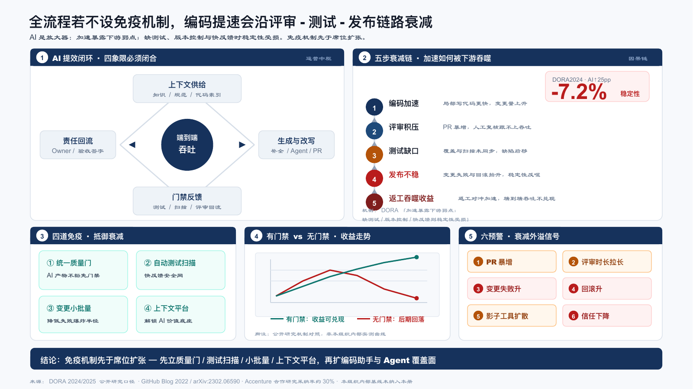
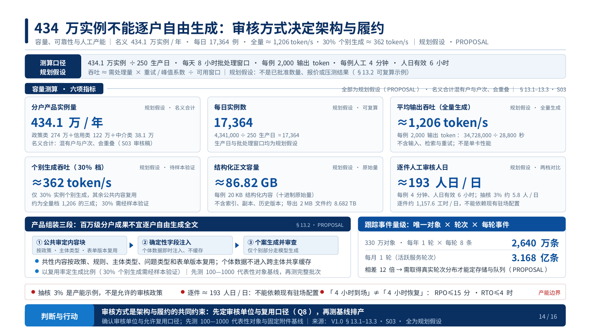
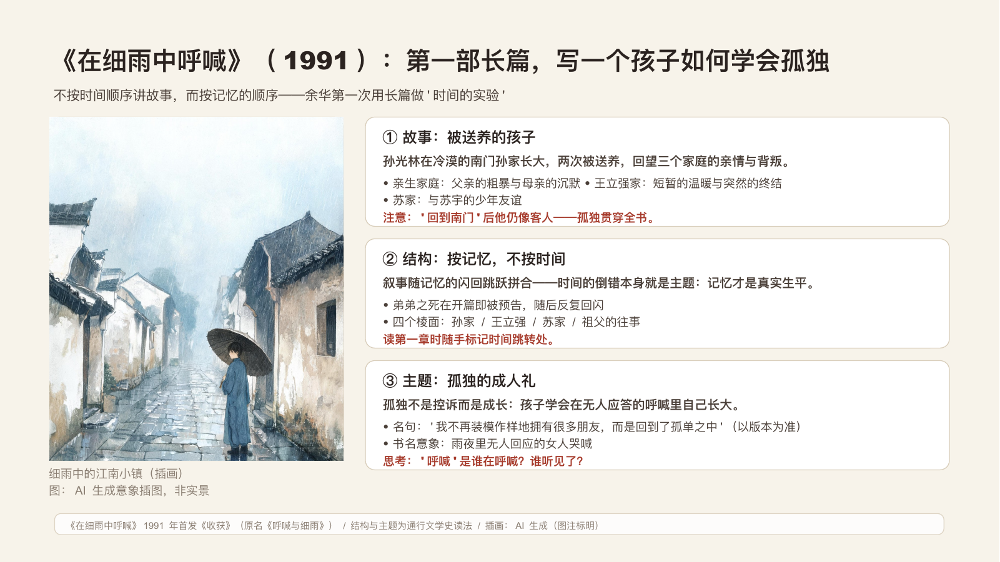
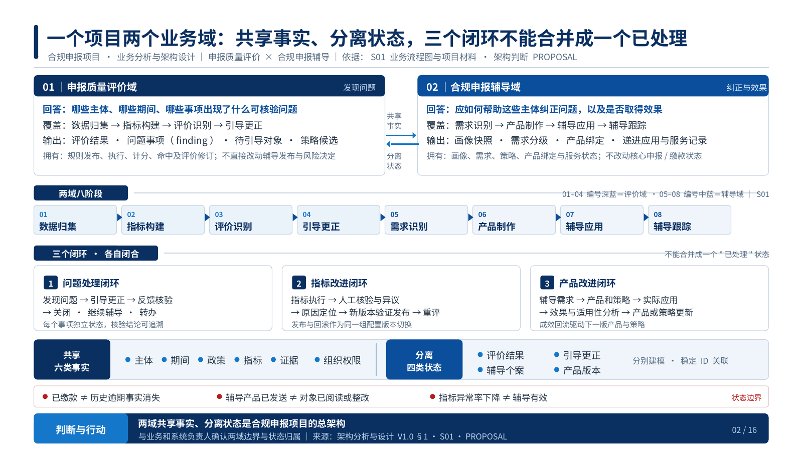
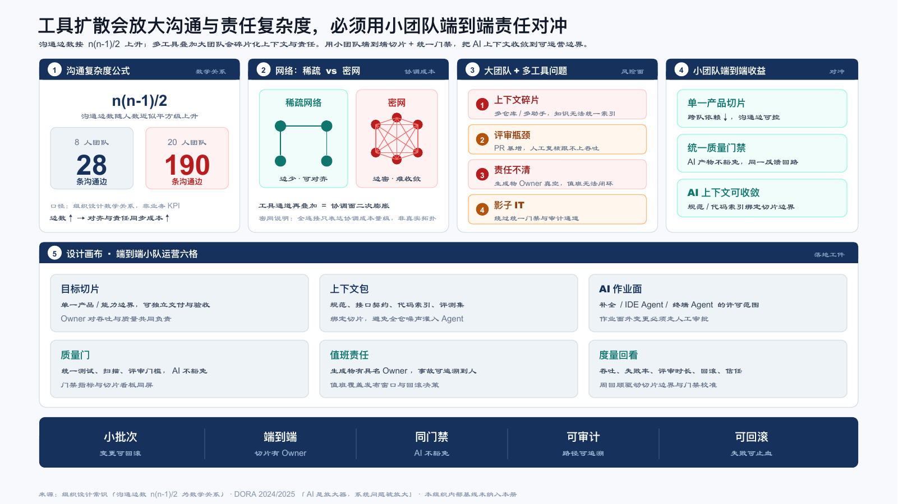
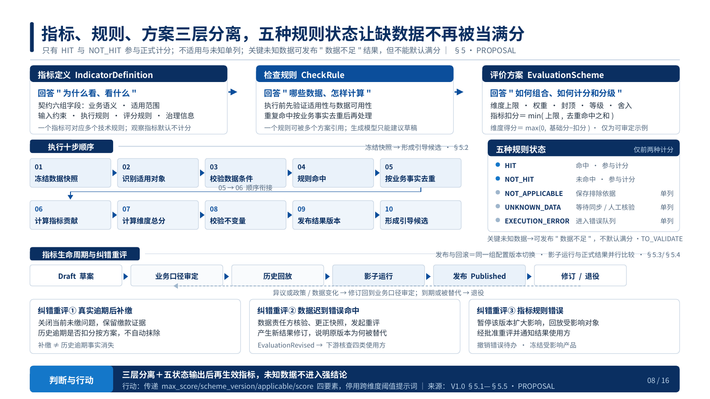
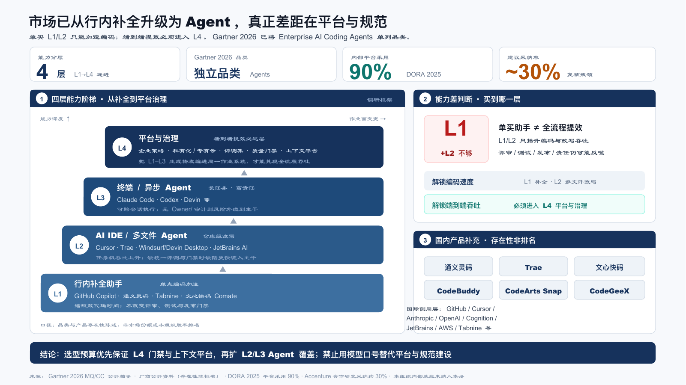

# ppt-workbench

给 Agent 用的中文业务汇报技能。结论先行，一页讲完一个判断，图表、表格和流程都是可编辑对象。

适合客户介绍、经营复盘、项目汇报、方案汇报和年度总结。

## 安装

```bash
npx skills add jyyconrad/ubrio-ppt
```

指定 Claude Code、Codex 或 Grok：

```bash
npx skills add https://github.com/jyyconrad/ubrio-ppt/tree/main/ppt-workbench -g -a claude-code -a codex -a grok -y
```

Claude Code 也可以登记插件市场：

```text
/plugin marketplace add jyyconrad/ubrio-ppt
```

也可以把 `ppt-workbench/` 整个目录复制到宿主的技能目录。目录名必须是 `ppt-workbench`。装好后还需要 Python 3.10+ 和 Node.js 20+，步骤见 [快速使用手册](ppt-workbench/docs/quickstart.md)。

## 效果

下面 8 张都是用这个技能做成的可编辑页，从三份成稿里挑出来：产品调研、架构评审、课堂讲读。架构评审稿发布前已去掉地区名和单位名。



| 434 万实例的审核容量 | 《在细雨中呼喊》 |
| --- | --- |
|  |  |

| 两个业务域 | 沟通复杂度 |
| --- | --- |
|  |  |

| 《第七天》与《文城》 | 五种规则状态 |
| --- | --- |
|  |  |



每张图的说明见 [效果图说明](ppt-workbench/docs/screenshots/captions.md)。

## 怎么用

把材料和任务目录交给 Agent，直接说要做的汇报。示例说法、依赖安装和完成标准在 [快速使用手册](ppt-workbench/docs/quickstart.md)。Agent 自己的工作入口是 [SKILL.md](ppt-workbench/SKILL.md)。

## 许可

仓库 [LICENSE](LICENSE) 的 MIT 适用于本技能自行编写的说明、脚本和合成样例。图标、图片、npm 依赖、vendor 代码和带水印的版式参考仍按各自许可使用，见 [THIRD_PARTY_NOTICES.md](THIRD_PARTY_NOTICES.md)。
