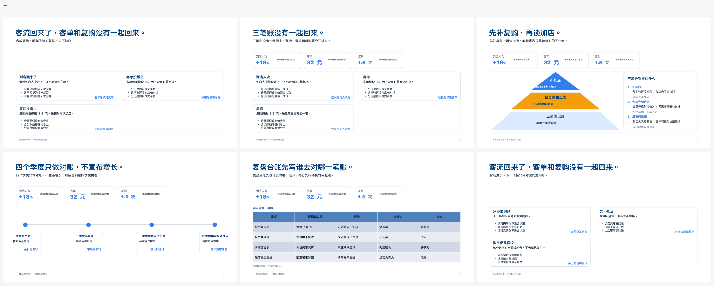
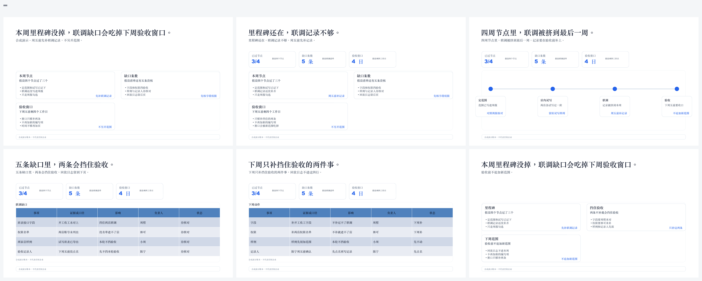
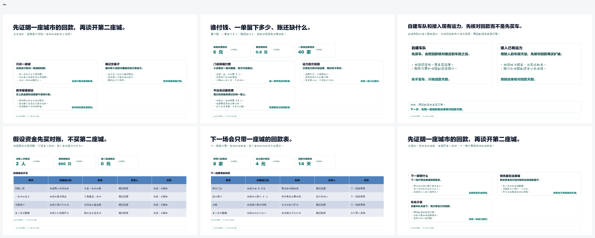
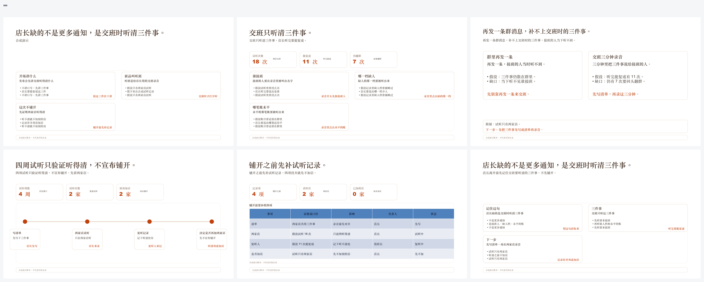
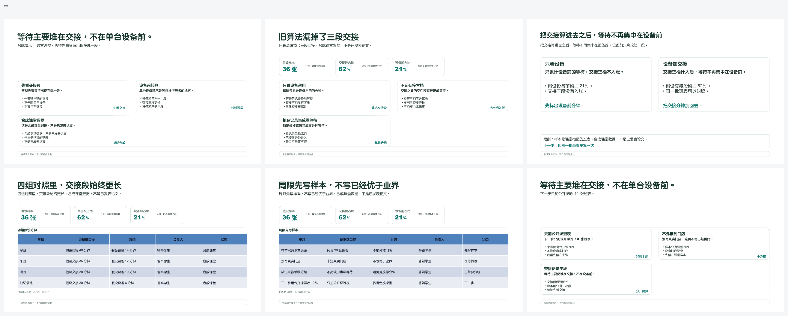
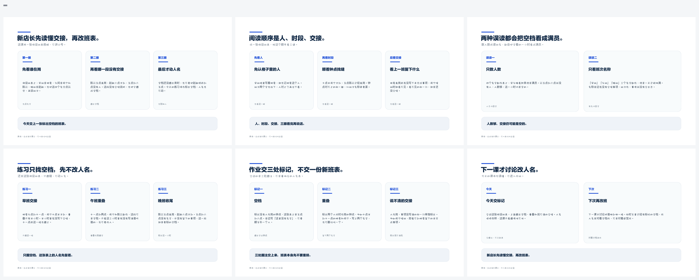
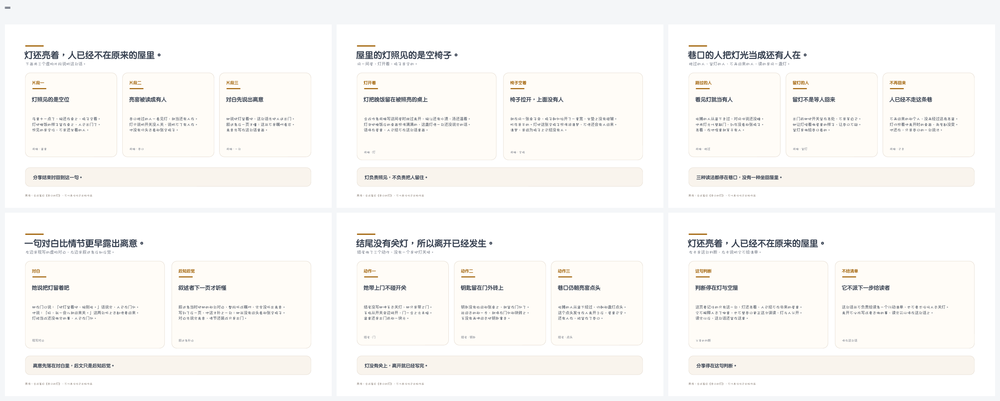

# ppt-workbench

给 Agent 用的中文业务汇报技能。结论先行，一页讲完一个判断，图表、表格和流程都是可编辑对象。

适合客户介绍、经营复盘、项目汇报、方案汇报和年度总结。

## 安装

```bash
npx skills add jyyconrad/ubrio-ppt
```

指定 Claude Code、Codex 或 Grok：

```bash
npx skills add https://github.com/jyyconrad/ubrio-ppt/tree/main/ppt-workbench -g -a claude-code -a codex -a grok -y
```

Claude Code 也可以登记插件市场：

```text
/plugin marketplace add jyyconrad/ubrio-ppt
```

也可以把 `ppt-workbench/` 整个目录复制到宿主的技能目录。目录名必须是 `ppt-workbench`。装好后还需要 Python 3.10+ 和 Node.js 20+，步骤见 [快速使用手册](ppt-workbench/docs/quickstart.md)。

## 效果

分类按技能图里的场景节点。每一张图是该场景一份 6 页合成演示的整册概览，页序从左到右、从上到下。工作简报、周报和里程碑归在项目汇报。店名、数字和人物都是合成演示，不代表任何企业。

### 年度总结



合成品牌澄叶，按假设的 2025 年、120 家店。项目蓝。整册判断写在封面和收口页。

### 项目汇报



商务蓝。周报、里程碑和工作简报用这一类：节点、缺口、时间线、缺口表和下周只补的两件事。

### 融资路演



合成公司厢记。页面检查把文字对照在白底上，深色满版里的浅色字达不到对比度，所以这册用浅底青绿墨色。

### 产品发布



合成产品听班。项目蓝加上暖棕与橙色字色。交班三件事、试听记录和铺开前要补的表放在同一册。

### 学术答辩



合成课堂，墨绿强调色。页内写明样本来自课堂签到表，是合成数据。

### 培训课程



纸感浅底，课堂蓝字色。一堂课按人、时段、交接往下读，练习只找空档。

### 书籍深读



合成小说《巷口的灯》，作者署名为合成作者周晚。文学纪录的纸感浅底，页内没有插图。

每册的场景节点、主题和页序见 [效果图说明](ppt-workbench/docs/screenshots/captions.md)。

## 怎么用

把材料和任务目录交给 Agent，直接说要做的汇报。示例说法、依赖安装和完成标准在 [快速使用手册](ppt-workbench/docs/quickstart.md)。Agent 自己的工作入口是 [SKILL.md](ppt-workbench/SKILL.md)。

## 许可

仓库 [LICENSE](LICENSE) 的 MIT 适用于本技能自行编写的说明、脚本和合成样例。图标、图片、npm 依赖、vendor 代码和带水印的版式参考仍按各自许可使用，见 [THIRD_PARTY_NOTICES.md](THIRD_PARTY_NOTICES.md)。
